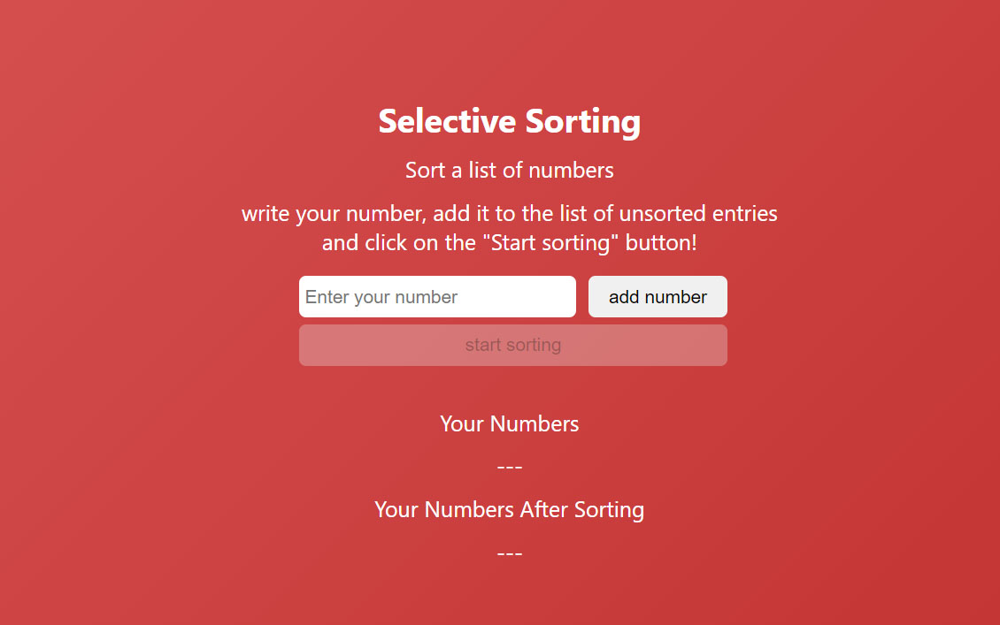

# Selection Sort Algorithm



[](https://opensource.org/licenses/MIT)

[](https://github.com/amirallami-code/selection-sorting-algorithm/)


An interactive demonstration of the Selection Sort algorithm.

## Table of Contents
- [Overview](#overview)
- [What is Selection Sort?](#what-is-selection-sort)
- [Features](#features)
- [Demo](#demo)
- [Usage](#usage)
- [Installation](#installation)
- [Contributing](#contributing)
- [License](#license)
- [Contact](#contact)
- [References](#references)

## Overview

This project provides a visual and interactive implementation of the Selection Sort algorithm, designed to help users understand how this sorting method works in practice.

## What is Selection Sort?

Selection Sort is an in-place comparison-based algorithm that divides the input list into two parts:
1. A sorted portion on the left
2. An unsorted portion on the right

The algorithm repeatedly selects the smallest (or largest) element from the unsorted portion and moves it to the end of the sorted portion.


### Advantages
- Simple to understand and implement
- Performs well on small lists
- Requires no additional memory space

### Limitations
- Not suitable for large datasets due to O(n²) time complexity

## Features

- ✅ Interactive sorting visualization
- 🔢 Custom number input
- 🔍 Step-by-step sorting process
- 📊 Before and after comparison

## Demo

Experience the algorithm in action: [Selection Sort Demo](https://selection-sorting-algorithm.vercel.app)

## Usage

1. Enter a number in the "Enter your number" input field.
2. Click "Add Number" to add it to the unsorted list.
3. Repeat steps 1-2 to add more numbers.
4. Click "Start Sorting" to begin the sorting process.
5. Observe the sorted result in the "After Sorting" section.

## Installation 

Clone the repository and open `index.html` in your web browser: 
```bash 
      git clone https://github.com/amirallami-code/selection-sorting-algorithm.git cd selection-sorting-algorithm
 ```

## Contributing

We enthusiastically welcome contributions! To contribute:
 1. Fork the project.
 2. Create your feature branch (`git checkout -b feature/AmazingFeature`).
 3. Commit your changes (`git commit -m 'Add some AmazingFeature'`).
 4. Push to the branch (`git push origin feature/AmazingFeature`).
 5. Open a pull request.

## License

This project is currently under the MIT license. For more information, see the [LICENSE](LICENSE) file.


## Contact

For questions or feedback, please contact:

Amirhossein Allami - [amirallami.dev@gmail.com](mailto:amirallami.dev@gmail.com)

Project Link: [https://github.com/amirallami-code/selection-sorting-algorithm](https://github.com/amirallami-code/selection-sorting-algorithm)

## References

1. [GeeksforGeeks - Selection Sort](https://www.geeksforgeeks.org/selection-sort/)
2. [Simplilearn - Selection Sort Algorithm](https://www.simplilearn.com/tutorials/data-structure-tutorial/selection-sort-algorithm)

---

⭐ Star this repository if you find it helpful!
